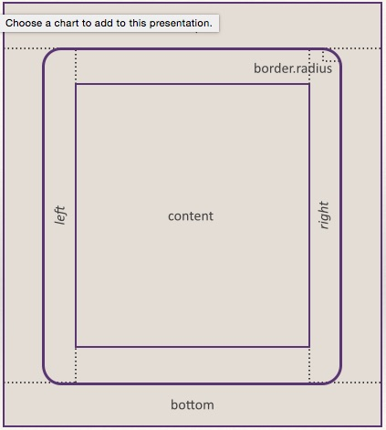

CSS: github.css

# Specifying Layout Parameters #

Layout specifications are given by variables whose names refer to the displayed objects. There are some basic types of displayed objects:

* Display
* Image
* Text
* Button
* TODO (more to come, like list container)

For each displayed object type layout parameters can be stated on different levels:

| Level | Object Types | Meaning | How specified | 
|  ------ |------ |------ |------ |
| Default | Each | For each object type for all quests on all portals | Predefined by QuestMill  Client by the default product definition. | 
| Portal | All | For all kinds of objects in all quests on the portal |  Defined in the portal specific product definition. Should be entered in the portal admin area and delivered in quest file in game node as xml element  "layout". | 
| Portal | Given type, e.g. "Text" | For objects of the given type on the portal | (same as above) | 
| Quest |All | For all kinds of objects in the given quest |  Entered in the quest editor among settings. Delivered in quest file in game node as xml element  "layout".|
| Quest |Given type, e.g. "Image" |  For objects of the given type in the given quest  |(same as above) |
| Page | All | For all objects in the page |  Entered in the quest editor on the page. Delivered in quest file in page node as xml element "layout".|
| Page | Given type, e.g. "Button"  |  For objects of the given type in the page | (same as above)  |
| Object  (TODO not yet possible) | Implicitly given | Only for the given object |   Entered in the quest editor with the object definition. Delivered in quest file in object node as xml element "layout"|  

For actually performing the layout, the parameters are looked up in the reverse order of the table above. I.e. first, it is looked for object-specific values and if not found for page-wide object-type-specific and so on, until if nothing else is found the predefined default value is used.1

# Structure of Layout Variable Names #

The layout variable names are composed of three parts:

1. object reference (e.g. "image" for all images)
2. layout elements (e.g. ".margin.top")
3. layout attributes (e.g. "size")

# General Layout Elements #

All displayed objects that occupy a certain area on the screen have some basic layout options in common: they have a *margin*, a *border* and a *padding*. All of these are optional and might be invisible. In this case only the content is shown and there is no distance (not even one pixel) to their neighbors on the screen.

The following image depicts the five basic screen estate parts each displayed object occupies:

* *area* - the whole screen estate the object occupies
* *border* - a visible frame around the visible object
* *margin* - a space on the outer side between the border and the neighbors
* *padding* - a space on the inner side between the border and the visible content of this object
* *content* - the screen space that is actually covered by the visible object

## Segments of Margin and Padding

To allow for a flexible layout, *margin* and *padding* are divided into eight segments: the four edges and the four corners which can be specified either separately or  as (partly overlapping) edges:

* *.margin.tl (top-left corner only)
* *.margin.tm (top-middle edge only)
* *.margin.tr (top-right corner only)
* *.margin.rm (middle-right edge only)
* *.margin.br (bottom-right corner only)
* *.margin.bm (bottom-middle edge only)
* *.margin.bl (bottom-left corner only)
* *.margin.lm (middle-left edge only)

## Convenience Segments of Margin and Padding

* *.margin.all (covers all eight segments)
* *.margin.top (covers the three top segments)
* *.margin.right (covers the three right segments)
* *.margin.bottom (covers the three bottom segments)
* *.margin.left (covers the three left segments)

## Attributes of Margin and Padding ##

The layout elements margin and padding (and all their segment variants) offer the same attributes:

| Attribute Name | Values | Meaning |  
|  ------	| ------	| ------	|  
| size | int | Width either in pixel or in per mille of screen size |  
| background | String | Either a color (e.g. "#6688eea5" or "#88eea5") or a path to an image (e.g. "images/bg.jpg") |

## Attributes of Border ##

The border layout element has the following attributes:

| Attribute Name | Values | Meaning |  
|  ------	| ------	| ------	|  
| width | int | width of the border line in number of pixel |  
| style | String | "straight", "dotted", or "dashed" |  
| color | String | A color specification (e.g. "#6688eea5" or "#88eea5") |  

## Attributes of Content ##

The content spaces of any object has the following attributes:

| Attribute Name | Values | Meaning |  
|  ------	| ------	| ------	|  
| background | String | Either a color (e.g. "#6688eea5" or "#88eea5") or a path to an image (e.g. "images/bg.jpg") |

# Layout Elements for Specific Content Objects #

## Layout Attributes for Images ##

For images the content layout element has the following attributes:

| Attribute Name | Values | Meaning |  
|  ------	| ------	| ------	|  
| image | path | refers to the image file |  
| scaletype | "fit" , "fill" |  How the image is scaled to fit into the content space |

The scaletype attribute values have the following meaning:

* "fit" - “fit” scales the image so that it its completely shown inside the content space and leaves the rest transparent, showing the content background
* "fill" - scales the image so that it covers just the complete content space. The superfluous images parts are cropped

## Layout Attributes for Texts ##

For the content of text objects the following layout attributes are defined:

| Attribute Name | Values | Meaning |  
|  ------	| ------	| ------	|  
| font | String | Name of a font |  
| text size | int | size of text in pixel |  
| adjustment | "left", "center", "right" | horizontal text adjustment of the text within the content space |  
| vertical adjustment | "top", "middle", "bottom" | vertical adjustment of the text within the content space |

